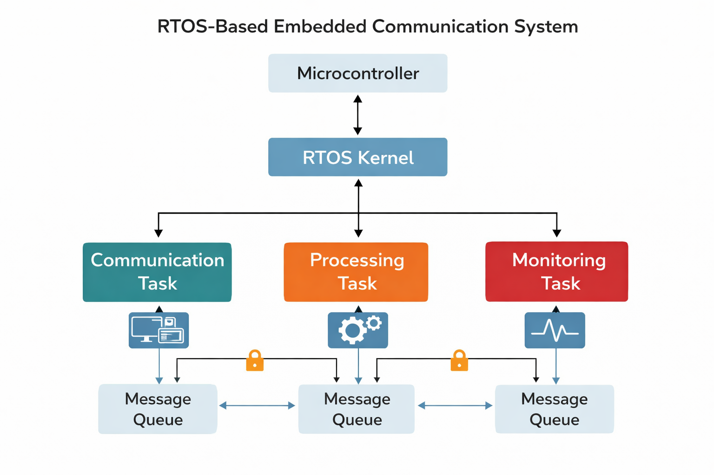

# RTOS-Based Embedded Communication System (C, Keil)

**Description:**  
This project involves the design and implementation of a real-time embedded communication system using a Real-Time Operating System (RTOS) in the Keil environment. The system leverages multitasking to manage communication processes efficiently, ensuring timely execution, task synchronization, and reliable data handling in embedded applications.

*Block diagram of an RTOS-based embedded communication system showing task scheduling, multitasking, and inter-task communication via message queues.*

**Technologies & Tools:**  
- Embedded C programming  
- RTOS (Real-Time Operating System)  
- Keil µVision IDE  
- Microcontroller-based development  
- Interrupt-driven and multitasking design principles  

**My Role & Contribution:**  
- Developed and configured RTOS-based tasks for communication processes  
- Implemented multitasking to handle concurrent operations efficiently  
- Managed task scheduling, synchronization, and inter-task communication  
- Integrated communication logic within an embedded environment  
- Performed debugging and validation within the Keil IDE  

**Expected Outcome / Impact:**  
- Demonstrates efficient multitasking in embedded communication systems  
- Improves responsiveness and reliability in real-time operations  
- Relevant for telecom systems, embedded networking, and time-critical applications  

**Note:**  
This repository contains project documentation and conceptual design. Source code and implementation details are not publicly available at this time.
